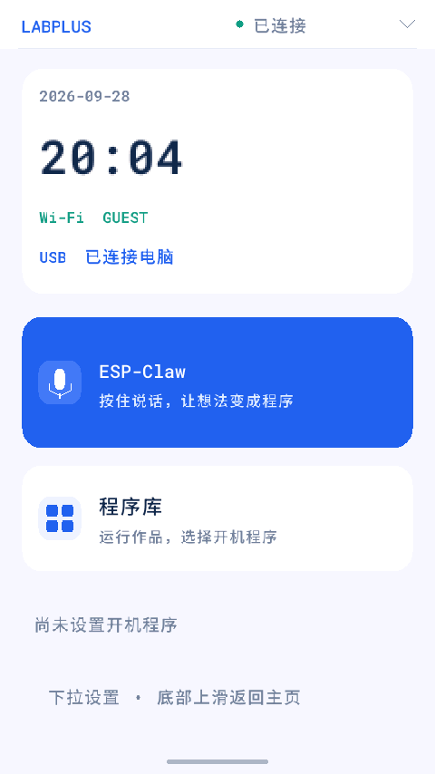

# Labplus MicroPython / ESP-Claw 集成

源代码基于 https://github.com/labplus-cn/esp-claw 的 `labplus-claw` 分支。
板型 `labplus_ledong_max_v1`，ESP32-P4、16 MiB Flash、32 MiB PSRAM。
设备直接连接千问实时语音 WebSocket，电脑仅用于开发、刷机和验证，不转发音频。

服务器转发方案见 [ESP-Claw Relay](../../server/espclaw-relay/README.md)。后端已实现，当前已发布固件仍采用直连，切换需适配服务器域名和独立设备令牌。

产品界面、交互规范和资源预算见 [PRODUCT.md](PRODUCT.md)。



## 使用

屏幕底部按住说话，松开发送。回答期间按下会取消当前回答、清空待播音频并开始收音；迟到的旧音频不会继续播放。
首次连接时一直按住，连接完成后开始收音；连接期间松手则不会自动录音。
触摸短暂丢点不会立即结束长按，连续约 120 ms 无触摸才确认松手。
文字区域支持上下滑动，用户界面不显示原始调试信息。

语音转写中的编程请求直接交给设备 agent，附带当前 MicroPython API、板型和引脚说明；一般设备问答仍可通过实时模型工具调用转交。
代码由真实 MicroPython 编译检查，失败会有限重试；通过后显示“运行”按钮并保存到程序库。编程结果保持静音。点击运行后使用选定代码，按钮变为“停止”。
每次运行最长 60 秒，停止/超时检查覆盖 Python 字节码循环和 `time.sleep()`；其他长期阻塞的原生扩展仍需自行配合取消。
生成程序运行时暂停实时语音，避免程序争用音频资源。完成后可再次按住说话。
当前解释器只有一个 VM，后台程序和 USB Python REPL 互斥。

Python 入口：

```python
import sys
sys.path.append('/sdcard')
import esp_claw

esp_claw.voice_start()
print(esp_claw.voice_status())
esp_claw.voice_stop()
print(esp_claw.ask('为当前开发板生成一个显示程序，只生成，不执行'))
```

也提供 `esp_claw.voice_press()` / `voice_release()`，与屏幕按键使用同一录音/打断逻辑。

```python
from labplus import display_text, button_pressed

display_text('你好 Labplus')
print(button_pressed())  # GPIO35，上拉，低电平按下

from labplus import countdown
countdown(10)
```

`display_text()` 复用当前界面，不重新初始化 LCD；不直接提供通用图形库。
本机 `machine` 没有 I2C/I2S/PWM/ADC 类，不应套用普通 ESP32 示例。
高级外设主要由已有 Lua 驱动管理，模型必须读取真实驱动文档，不能虚构 Python 包装接口。

```python
import labplus_wifi
labplus_wifi.connect('你的SSID', '你的密码', timeout_ms=30000)
print(labplus_wifi.status())
```

新 Wi-Fi 连接拿到 IP 后才保存；失败尝试恢复旧配置并抛出 OSError。
语音 API Key 从设备已保存配置读取，源码和发布包不含密码、API Key。
麦克风输入增益配置为 65/100，扬声器音量为 35/100。暂未实现声学回声消除。待机、录音和打断时将 DAC 静音并关闭 GPIO12 功放，仅在播放回答时开启。
打断回答不等于撤销已经开始的设备工具操作，已提交操作可能继续完成。

## 构建与部署

ESP-IDF v5.5.4 的 P4 USB FIFO 写入存在读改写问题：读寄存器会同时消耗接收字节。
全新 SDK checkout 须应用 `patches/esp-idf-p4-usb-fifo.patch`；已修正的 SDK 不要重复应用。
`tests/usb_fifo_access.py` 用破坏性读取模型验证发送不消耗接收数据，并确认旧实现会触发失败。
交付包的 `esp-idf.patch` 另包含完整 SDK 本地差异，重建时应以该补丁和锁定提交为准。

```sh
. /Users/james/esp32-build/esp-idf-v5.5.4/export.sh
cd /Users/james/esp32-build/labplus-esp-claw/application/edge_agent
idf.py bmgr -c ./boards -b labplus_ledong_max_v1
idf.py build
```

`sdcard/` 内容按目录结构部署到设备 `/sdcard/`。必须与新增原生模块配套。
新增组件包含 WebSocket、流式音频转换、MicroPython runner 和 Python Wi-Fi 接口。
Lua 模块注册表容量由 32 扩至 64，避免本板启用模块及别名超限。
触摸采样的控制器读取与缓存消费持有显示服务锁，避免与系统 LVGL 输入回调争用同一缓存。

刷机前核实活动 OTA 槽并保留备份。当前设备活动应用为 ota_0：0x20000，大小 0x500000。
SYSTEM：0xA20000，大小 0x28A000。只更新目标应用及必要的 SYSTEM；不要直接使用默认
`idf.py flash` 覆盖 OTA 元数据、storage 或 NVS。SD 卡内容需要单独备份。

## 验证

```sh
python integration/labplus/tests/websocket_queue.py
python integration/labplus/tests/module_registry.py
python integration/labplus/tests/touch_sampling.py
python integration/labplus/tests/python_runner.py
python integration/labplus/tests/owned_io.py
python integration/labplus/tests/usb_fifo_access.py  # IDF_PATH 指向本次 SDK
python integration/labplus/tests/lua_allocator.py
python integration/labplus/tests/countdown.py
python integration/labplus/tests/run.py  # 需要 lupa
```

主机测试覆盖模块容量回归、并发缓存消费、触摸丢点、按住/松手、打断时迟到事件、代码选择不执行及显式运行。
2026-09-27 真机已验证程序显示、Python 循环停止/超时、sleep 超时、程序完成后重新进入 REPL。
真机验证包括 HelloLabplus 实体运行按钮、播放中打断、36 次页面切换、实际 Wi-Fi 扫描和三次语音建立/关闭；详见交付包验证记录。最新触摸手感、键盘与网络输入仍需人工体验，不以主机模拟代替。

设备内部诊断文件：`labplus/voice-status.json`、`screen-status.json`、`program-status.json`。
完整开发与刷机记录在 `/Users/james/esp32-build/device-test-20260927/`。

最新产品导航与开机程序详见 PRODUCT.md。2026-09-27 真机追加验证：
默认程序重启执行、超过 60 秒持续运行、停止、切换及取消后重启主页；
USB 主机连接与联网时钟正常。自然中文倒计时请求生成 labplus.countdown(10)，无代码朗读。


## 2026-09-28 工程测试版

最新功能与稳定性加固的证据见 [validation/STABILITY.md](validation/STABILITY.md)，各次测试对应固件哈希见 [validation/test-provenance.json](validation/test-provenance.json)。长测按用户要求提前结束，之后只追加定向修复回归，不宣称完整 20 分钟或长期老化通过。

复现构建使用 `build-config/revisions.json` 指定的 ESP-IDF/MicroPython 提交。先对 ESP-IDF 应用 `patches/esp-idf.patch`（已包含 USB FIFO 修正，无需重复应用子补丁），再使用 `build-config/sdkconfig`、依赖锁及 16 MiB 分区配置，按仓库板型生成说明构建 `labplus_ledong_max_v1`。本地 Python 工具依赖 pyserial，主机 Lua 测试另依赖 lupa。

已有设备仅更新 ota_0 的 `edge_agent.bin`（地址 `0x20000`）与配套 SD 文件。保留 NVS、storage、用户程序、Wi-Fi、密钥、开机选择及已有 scheduler/router 配置；不要直接执行会覆盖所有分区的默认 `idf.py flash`。

USB 开发工具为 `tools/device.py`。仅用于调试的桥接接口与设备 HTTP 服务应在可信局域网使用。公开仓库和发布包不包含真实密钥、Wi-Fi 密码或私人配置。
