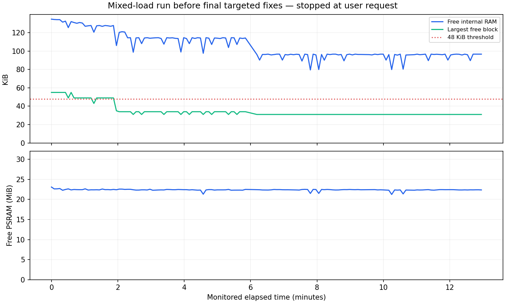

# Labplus 固件稳定性记录 · 2026-09-28

**工程测试版，已完成已定位问题的定向修复与回归，非量产认证。** 用户要求停止长测后，已停止测试、清理临时程序并恢复原开机选择。长测版本未完成原定 20 分钟；此后补充了 HTTP 分发线程与 USB 测试工具同步修正，并完成针对性复核。最终镜像未重跑完整长测。

## 最终设备与固件

- Labplus 乐动 Max，ESP32-P4 rev3.2，16 MiB Flash / 32 MiB PSRAM。
- 应用 4,897,952 字节，ota_0 地址 `0x20000`，烧录回读校验通过。
- SHA-256：`a45113a2db9b037e66a6e2e9cf4bc2f1abe28f18717e6ac68ecae50029069d6c`。
- Wi-Fi、密钥、用户程序、原始备份均保留；主界面、USB、Wi-Fi 和心跳在清理后复核正常。
- SD 核心文件逐个回读比对，详见 final-validation.json。

## 本轮发现与修正

| 问题 | 处理 |
|---|---|
| 用户程序的大整数、字符串、迭代和微秒等待绕过停止 | 原生循环增加调度/取消检查，构建时生成端口副本 |
| 深递归导致 panic | 显式启用栈检查，限定执行/验证栈预算 |
| 用户程序漏关文件/目录耗尽 SD 句柄 | 每 VM 最多 3 个句柄，结束时统一关闭；分块 I/O 可取消 |
| 未支持外设类型和遗留中断风险 | 使用有效类型明确报不支持；禁止未接入生命周期的 GPIO IRQ |
| USB 突发输入和双向传输丢字 | 收发缓冲各 4 KiB；修正 P4 HAL 对 FIFO 的读改写为直接写入 |
| 上传中断删除原文件 | 临时文件接收、限时重试、完成后替换；失败尝试恢复原文件，不声称断电事务保证 |
| 默认长扫描、反复进入 Wi-Fi 页面争用无线资源 | 限定信道驻留；自动结果复用 30 秒、手动刷新间隔至少 5 秒 |
| 语音启动通过本机 HTTP 读取配置，上传阻塞时拖住 UI | 改为原生模块读取内存配置，不向 Lua 暴露密钥 |
| 慢上传让整个 HTTP 服务等待 | 独立上传工作线程、一个执行和一个排队，超额请求返回 503；上传停顿期间状态查询最长 0.77 秒 |
| USB 工具可能误读延迟的旧提示符 | 单换行握手、发命令前消费残留输出；延迟提示符模型验证旧机制失败、新机制通过；真机并发复核通过 |
| 网络发送及握手清理可能阻塞 UI | 有界后台发送队列；关闭立即返回，后台等待回调结束再回收；最多两个活动/回收连接 |
| 大段中文刷新缓慢、按住说话离开后状态残留 | 512 字形逐项替换缓存、按行关闭字体句柄、离开页面清除触摸状态 |

USB FIFO 修正参照 [Espressif P4 HAL](https://github.com/espressif/esp-idf/blob/master/components/esp_hal_usb/esp32p4/include/hal/usb_serial_jtag_ll.h)。源码及 SDK 补丁随版本保存。

## 已取得的测试证据

| 项目 | 结果与范围 |
|---|---|
| 长测构建连续操作 | 设备最近进度记录 13.97 分钟、2016 次页面切换、252 次程序运行、12 轮语音进出；用户要求提前结束 |
| 界面和程序时限 | 已完成步骤通过每次页面小于 3 秒、程序结束小于 4 秒的断言；没有最终汇总，故不提供 P95 或精确最大值 |
| 独立监测 | 394 个采样，覆盖 12.95 分钟；停止电脑采集到停止设备任务之间不计入独立监测覆盖 |
| 内存 | 采样内部 RAM 最低 79.5 KiB、最大连续空闲块最低 31.0 KiB、PSRAM 最低 21.23 MiB |
| 重启/看门狗 | 已采集串口未发现 panic、看门狗或启动标记；没有以重启方式清理本次长测状态 |
| 扫描缓存构建专项 | 10 次真实扫描，4.55–4.76 秒；56 次并发 64 KiB 上传，无上传/监测错误；缓存与刷新间隔断言通过 |
| 程序容错回归 | 35 组故障/边界、8 组主动停止、100 次资源生命周期、VM 互斥、失败 Wi-Fi 恢复；在前序同解释器构建上通过 |
| USB REPL 与输入 | 6 类长任务 Ctrl+C、递归恢复、100 次突发命令通过；最终构建另完成语音播放并发下 100 条命令、19 次串口重连、48 次上传，无通信/监测错误，界面最长 500 ms |
| 语音专项 | 真实云端播放、按下打断、下一轮回答通过；上传停滞时启动/退出、20 次连接取消、不可达地址 GC/重复关闭/容量拒绝及重新连接通过 |
| 文件上传异常 | 断开保留原文件、停顿 6 秒续传、10 秒空闲失败、30 次覆盖回读通过 |
| 开机程序 | 前序构建验证跨重启运行超过 60 秒、停止、切换、取消；本次停止长测后没有追加重启回归 |

各项对应的固件哈希见 test-provenance.json，不能把前序构建记录混称为最终构建重新测试。触摸单元测试与真实应用桥接压力测试不同，未用机械手覆盖所有物理触摸组合。

## 历史失败与验证边界

- 修正前长测监测到 **1 次超过 15 秒的 HTTP 暂时失联**，单次请求超时共 12 次；之后恢复，设备操作循环继续推进。随后定位到上传占用 HTTP 分发线程，已改为后台工作线程；最终构建的慢上传定向测试及语音/USB/上传并发测试均通过。历史失败记录保留，不改写成通过。
- USB 控制台曾出现输出缺失/命令不同步。除已修正的 FIFO 读改写问题，还修正了测试工具的双换行与残留提示符处理；最终并发复核通过。旧日志保留，单次历史异常与具体原因不能全部一一对应。
- 长测由用户提前停止，上传线程最终计数/错误列表没有保存；不声称长测上传错误为零。独立扫描专项的上传计数和结果完整。
- 本轮未完成最终版本 20 分钟全项验收，也未做 24–72 小时老化、供电波动、拔出/损坏 SD 等测试。不能证明任意程序/硬件故障下永不卡死。
- 用户程序采用可取消字节码、1 MiB Python heap 与资源配额。Native/Viper/原生机器码 .mpy 禁用；显式复位、休眠和特权硬件操作不属于意外死机。

生成时间：2026-09-28T20:05:41+08:00
